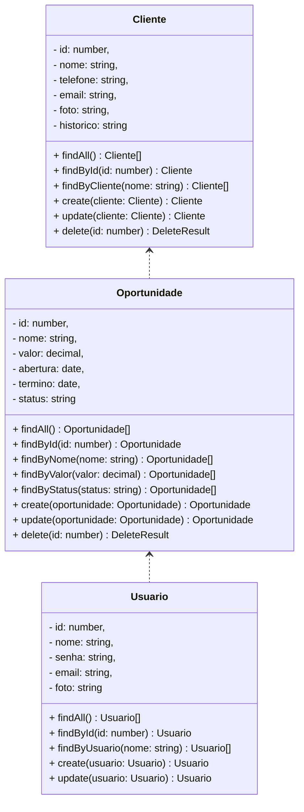

# Nome do Projeto - Backend

 

    

  

## 1. Descrição

Descreva brevemente o seu projeto

------

## 2. Sobre esta API

Descreva brevemente a API que foi construída

### 2.1. Principais Funcionalidades

1. Liste as principais funcionalidades e as features especiais do sistema

------

## 3. Diagrama de Classes

Obs: Add Whatsapp / CPF na entidade Cliente.

## 4. Diagrama Entidade-Relacionamento (DER)

Adicione a imagem do DER

    

------

## 5. Tecnologias utilizadas

| Item                          | Descrição  |
| ----------------------------- | ---------- |
| **Servidor**                  | Node JS    |
| **Linguagem de programação**  | TypeScript |
| **Framework**                 | Nest JS    |
| **ORM**                       | TypeORM    |
| **Banco de dados Relacional** | MySQL      |

------

## 6. Configuração e Execução

1. Clone o repositório
2. Instale as dependências: `npm install`
3. Configure o banco de dados no arquivo `app.module.ts`
4. Execute a aplicação: `npm run start:dev`
