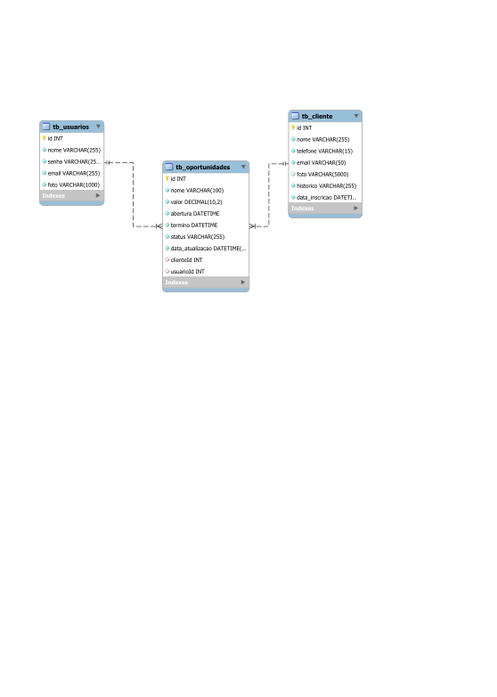

# 2Connect - Backend

 

    

  

## 1. Descrição

Este projeto é um sistema CRM desenvolvido para organizar e gerenciar informações de clientes, usuários e oportunidades de negócios. Com uma aplicação prática e funcional, ele permite cadastrar, consultar, atualizar e excluir dados de forma eficiente, utilizando tecnologias modernas para atender às necessidades das empresas.

------

## 2. Sobre esta API

A API de Gestão de Relacionamento com Clientes (CRM) foi criada para ajudar empresas a gerenciar clientes, usuários e oportunidades de forma simples e eficiente, permitindo realizar operações como cadastro, consulta, atualização e exclusão de dados.

### 2.1. Principais Funcionalidades

#### 1. **Gerenciamento de Clientes**

- Cadastrar, atualizar e excluir clientes.
- Buscar clientes por nome, e-mail ou ID.
- Listar todos os clientes cadastrados.

#### 2. **Gerenciamento de Oportunidades**

- Criar, editar e excluir oportunidades de negócio.
- Filtrar oportunidades por status (aberta, fechada, perdida) ou valor.
- Buscar oportunidades por nome ou ID.
- Listar todas as oportunidades registradas.

#### 3. **Gerenciamento de Usuários**

- Cadastrar, atualizar e listar usuários.

- Buscar usuários por nome, e-mail ou ID.

- Garantir segurança com validação de e-mail único.

  ------

  ####  Diferenciais do Sistema

  - **Fácil de usar**: Interface simples e intuitiva.
  - **Organização total**: Tudo centralizado em um só lugar.
  - **Flexível**: Adapta-se às necessidades da sua empresa.
  - **Seguro e confiável**: Desenvolvido com tecnologia moderna.

------

## 3. Diagrama de Classes

## 4. Diagrama Entidade-Relacionamento (DER)

    

------

## 5. Tecnologias utilizadas

| Item                          | Descrição  |
| ----------------------------- | ---------- |
| **Servidor**                  | Node JS    |
| **Linguagem de programação**  | TypeScript |
| **Framework**                 | Nest JS    |
| **ORM**                       | TypeORM    |
| **Banco de dados Relacional** | MySQL      |

------

## 6. Configuração e Execução

1. Clone o repositório
2. Instale as dependências: `npm install`
3. Configure o banco de dados no arquivo `app.module.ts`
4. Execute a aplicação: `npm run start:dev`
